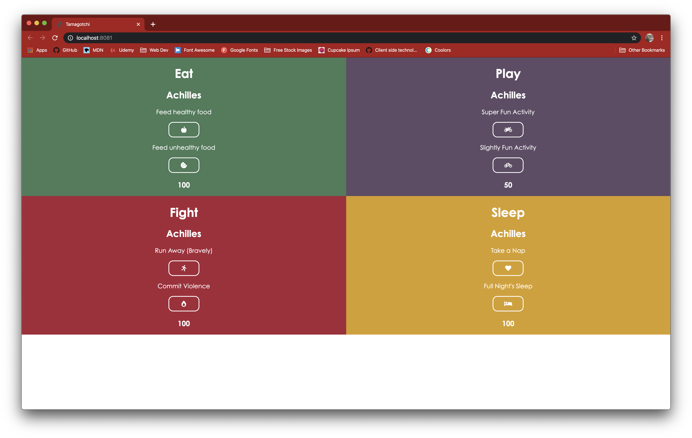

# tamagotchi

## Description
An initial introduction to using scss with modular javascript.

## Screenshots

## Instructions
1. Clone down this repo
2. Make sure you have http-server installed via npm. If not get it here [HERE](https://www.npmjs.com/package/http-server)
3. On your command line run `hs -p 9999`
4. In your browser go to `http://localhost:9999`